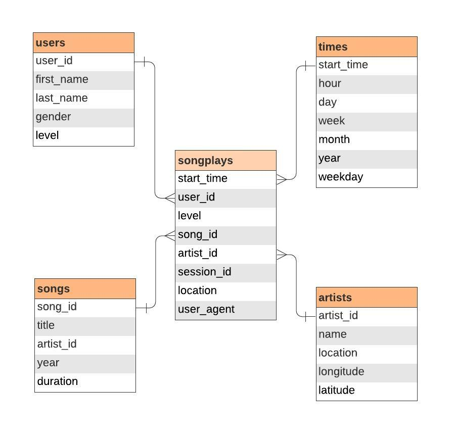

# Modeling Data using PostgreSQL

This project analyzes song streaming data. There are two datasets, each initially stored in JSON format: song data and log data. 

I want to model these two datasets in as a star schema to store in a local PostgreSQL server. I then want to create an ETL pipeline that takes the JSON files and uploades it to the server. This will accomplish two things:

1. It will logically connect both datasets so user data is related to song data through fact and dimension tables. This will allow for the tracking of user activity.

2. It will decrease overall latency, optimizing the process and providing faster access to song and user data.

## Database Schema

