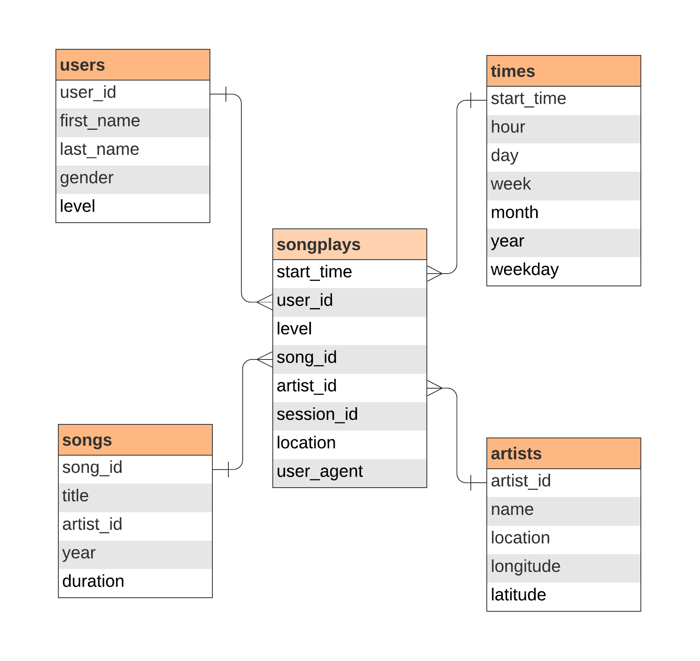

# Modeling Data using PostgreSQL

This project models song streaming data for analysis. There are two datasets, each initially stored in JSON format: song data and log data. 

I want to model these two datasets as a star schema to store in a local PostgreSQL server. I then want to create an ETL pipeline that takes the JSON files and uploades it to the server. This will accomplish two things:

1. It will logically connect both datasets so user data is related to song data through fact and dimension tables. This will allow for the tracking of user activity.

2. It will decrease overall latency, optimizing the querying process and providing faster access to song and user data.

## Database Schema

## Project Organization

This schema can be replicated and populated by running the below two scripts:

- <b>create_tables.py</b>: This script creates and connects to a database named `sparkifydb` and creates the fact table and four dimension tables via the <b>sql_queries.py</b> file.
- <b>etl.py</b>: This script connects to the database, extracts and transforms the JSON files in log_data and song_data, and loads the data into the database according to the schema—also via the <b>sql_queries.py</b> file.

The notebook <b>test.ipyb</b> allows for testing the database connection and running SQL queries on it.